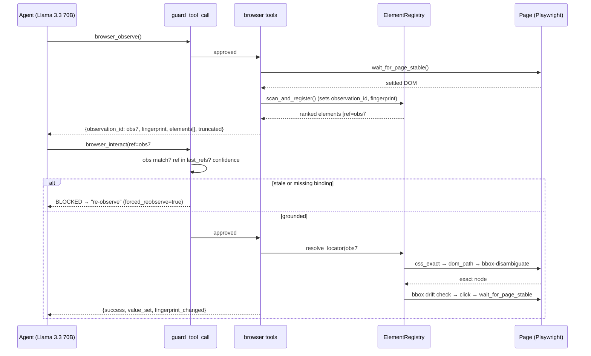
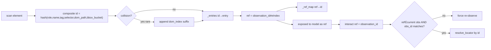
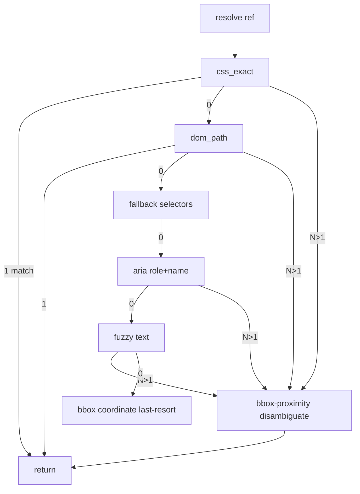

# Browser Agent Remediation — Production Plan

**Scope:** The live execution path only — `main.py → services/llm_service.py → workflows/master_graph.py → tools/browser_tool.py → tools/browser_state.py`. The v2 planner/`browser_agent.py` graph is **not** wired into production and is treated as a source of ideas to port, not the target.

**Author note:** Every fix below references real symbols in your repo so they are drop-in, not generic. Line references are to the files as read on the analysis date and may drift slightly as you edit.

---

## 0. Executive summary

Your browser inaccuracy is **not** a reasoning-model problem. It is a **grounding-integrity** problem in four places, all in `tools/browser_state.py` and `workflows/master_graph.py`:

1. **Identity is lossy.** `_generate_stable_id(role, name, tag, selector)` hashes only semantic fields, so duplicate elements (ten "Add to cart" buttons) collapse to one registry entry. Index→element mapping silently becomes wrong. *(Issue #1)*
2. **Resolution discards the observed element.** `resolve_locator` tries fuzzy `get_by_role(name=...)` first and falls to the exact captured selector only as strategy 5, then picks `.first` visible across N matches. The element you scanned is effectively thrown away. *(Issue #2)*
3. **Actions are not bound to the observation that produced them.** The guard (`_score_tool_call`) only checks `element_id ∈ last_element_ids`, and because indices reset to `1..N` on every observe, almost any stale ID "passes." There is no fingerprint check at action time even though you already compute `page_fingerprint`. *(Issue #3)*
4. **The model sees half the page.** `scan_and_register(max_elements=120)` but `to_llm_list(max_items=50)` — and selection is by raw Y-order, so the goal-relevant element is frequently truncated away. *(Issue #4)*

Plus a reliability multiplier: **fixed `wait_for_timeout` calls race SPA re-renders**, so observations are built on transient DOM and the *next* turn's IDs are wrong before grounding even starts *(Issue #5)*.

Fixing #1, #2, #3 in that order removes the majority of "clicked the wrong element" failures. #4 and #5 raise task-completion rate on dense and dynamic sites. Recommended canonical architecture: **keep `master_graph` and port the useful v2 ideas** *(Issue #6)* — justified in §3.

---

## 1. Root cause analysis (deliverable 1)

Each root cause is tied to the exact code that causes it.

### 1.1 Issue #1 — Stable ID collisions

`tools/browser_state.py`:

```python
@staticmethod
def _generate_stable_id(role, name, tag, selector):
    raw = f"{role}:{name}:{tag}:{selector}"
    return f"el_{hashlib.sha256(raw.encode('utf-8')).hexdigest()[:8]}"
```

And in `scan_and_register`:

```python
self._entries[stable_id] = entry      # (A) duplicate key overwrites prior entry
self._index_map[idx] = stable_id      # (B) every distinct index still points at it
```

On a product grid, every "Add to cart" button has identical `role=button`, `name="Add to cart"`, `tag=button`, and frequently an identical `selector` (the JS builds `tag.firstClass` when there's no id/aria/name). So:

- `stable_id` is identical for all of them.
- Line (A) keeps only the **last** scanned duplicate in `_entries`.
- Line (B) maps indices 12, 18, 24… all to that **one** surviving `stable_id`.
- `to_llm_list()` iterates the de-duplicated `_entries.values()`, so the **count the LLM sees ≠ the count in `_index_map`**, and `get_by_index(12)` and `get_by_index(18)` return the *same* entry.

Net effect: "click the third result" reliably hits the first/last. This is the single highest-impact defect.

### 1.2 Issue #2 — Locator resolution ignores the observed element

`resolve_locator` strategy order is: ARIA role+name (exact, then loose) → label → text → placeholder → **primary CSS selector (strategy 5)** → fallback CSS → bbox coordinate (last resort). The `name` fed to `get_by_role` is `innerText[:80]`, normalized and truncated. On repeated labels this matches many nodes; the code then does:

```python
if count > 1:
    for i in range(count):
        if await base_locator.nth(i).is_visible():
            resolved_loc = nth_loc; break   # picks FIRST visible, not the scanned one
```

So even when identity is correct, resolution re-queries the DOM by fuzzy text and lands on a sibling. The exact `entry.selector` and `entry.bbox` you captured at scan time are only consulted after four fuzzy strategies, and bbox is never used to *disambiguate* — only as a final blind click.

### 1.3 Issue #3 — Stale-observation execution

Guard logic in `master_graph._score_tool_call` for `browser_interact`:

```python
allowed_ids = set(state.get("last_element_ids") or [])
is_valid = element_id in allowed_ids  # (+int/str coercions)
if not is_valid: return 0.42, "element_id_not_in_latest_observation"
return 0.92, "grounded_element_id"
```

Because `scan_and_register` calls `self.clear()` and resets `_next_index = 1` every observe, `last_element_ids` is always `[1..N]`. A stale ID `5` from a previous page passes the membership test and scores `0.92`, then acts on the *current* element #5. You **already compute** `last_page_fingerprint` in `record_tool_result`, but it is never checked at action time. There is no binding between "the observation the model reasoned over" and "the page as it is when the click fires."

### 1.4 Issue #4 — Observation truncation

`observe_page_state` → `registry.to_llm_list(max_items=50)`, while `scan_and_register(max_elements=120)`. Elements are ordered by `sortY` (vertical position). On dense pages the relevant control (a filter, a specific product's button, a date cell) is past index 50 and is silently dropped from the payload. The model then guesses an in-range ID (which, per #3, passes the guard) or scrolls blindly.

### 1.5 Issue #5 — SPA timing

`interact` and `interact_by_id` use fixed `wait_for_timeout(2000–3000)`; `observe_page_state` waits only for `domcontentloaded` (5s, exception swallowed). SPAs mutate the DOM after these fixed windows, so:

- The registry is built mid-render → indices reference elements that vanish.
- `_page_fingerprint` (in `master_graph`) is computed off a transient AX tree, so the next turn's fingerprint mismatch is *real but noisy*.

This is the reliability multiplier behind intermittent failures that "work on retry."

### 1.6 Issue #6 — Architecture fork

Two grounding stacks exist; only `master_graph` runs. The v2 `browser_agent.py` has better *tactics* (date guards, autocomplete follow-up, pre/post-action assertions, confidence scoring) but the same flawed *substrate* (`browser_state.py` registry). Porting tactics onto a fixed substrate beats migrating wholesale (§3).

---

## 2. Recommended architecture (deliverable 2)

The grounding substrate is shared by every path, so **fix the substrate once, in `browser_state.py`, and every consumer benefits.** The redesign introduces one principle:

> **An interaction is a transaction against a specific observation.** The element identity, the observation it belongs to, and the page fingerprint travel together from `browser_observe` to `browser_interact`. The guard enforces the transaction boundary; the resolver honors the captured identity.

Three substrate upgrades carry the whole plan:

1. **Composite element identity** (`ElementRegistryEntry` gains `dom_path`, `dom_index`, `bbox`, and a per-observation `ref`), so duplicates never collide.
2. **Identity-first resolution** with bbox/DOM disambiguation, so the resolver returns the *exact* scanned node.
3. **Observation binding** — every observation carries an `observation_id` + `page_fingerprint`; every interact tool call carries the `observation_id` it was chosen from; the guard rejects mismatches and forces re-observe.

The LLM-facing contract changes minimally: `browser_observe` returns an `observation_id` and a richer, ranked element list; `browser_interact` gains an `observation_id` argument. Everything else (Llama 3.3 70B, the ReAct loop, vision injection) is unchanged.

### 2.1 Component responsibilities after refactor

| Layer | File | Responsibility after fix |
|---|---|---|
| Identity & scan | `browser_state.py::ElementRegistry` | Composite IDs, DOM-path capture, ranking, observation versioning |
| Resolution | `browser_state.py::resolve_locator` | Exact selector → DOM path → bbox-validated → semantic → fuzzy, with disambiguation |
| Sync | `browser_state.py::observe_page_state` + new `wait_for_page_stable` | networkidle + mutation-settle before scanning |
| Tool surface | `tools/browser_tool.py`, `workflows/tool_wrapper.py` | Thread `observation_id` through observe/interact |
| Guard | `workflows/master_graph.py::guard_tool_call` / `_score_tool_call` | Fingerprint-bound validation, force re-observe |
| State | `workflows/master_graph.py::AgentState` | Track `current_observation_id`, `current_fingerprint` |

---

## 3. Issue #6 decision: keep master_graph, port v2 tactics (deliverable 2 + 6)

**Recommendation: Option A — keep `master_graph` as canonical; port v2's *tactics* onto the fixed substrate.**

### 3.1 Why not migrate to v2

| Factor | master_graph (A) | v2 graph (B) |
|---|---|---|
| Wired to prod | ✅ live, battle-tested with your guard/interceptor/vision stack | ❌ only `run_v2_e2e.py`; never exercised with real traffic |
| Multi-domain | ✅ browser + file + WhatsApp + weather tools in one ReAct loop | ⚠️ browser-centric; system_executor exists but unproven |
| Vision | ✅ sticky vision model, screenshot injection, image pruning | ❌ text-only Bedrock call, screenshots captured but unused for grounding |
| Llama hallucination handling | ✅ interceptor parses malformed tool calls | ❌ assumes clean JSON; would regress on Llama |
| Bedrock turn-structure correctness | ✅ `clean_messages_for_bedrock`, validation retry | ❌ not handled |
| Grounding quality | ❌ shared broken substrate | ❌ **same** broken substrate (`browser_state.py`) |

Both share the defective substrate, so migrating to B costs you the entire production hardening layer in A **without** improving grounding. The grounding win comes from fixing `browser_state.py`, which B also depends on.

### 3.2 What to port from v2 into master_graph (as tools/helpers, not nodes)

- **Pre/post-action assertion** (`_assert_action_outcome`): fold into `record_tool_result` to detect "click produced no observable change."
- **Autocomplete follow-up** (`_autocomplete_followup_action`) and **date guard** (`_validate_date_click_action`): expose as deterministic post-processing inside `browser_interact`/a new `browser_select_option` tool (see §10).
- **Confidence scoring** (`_score_candidate_action`): you already have `_score_tool_call`; merge v2's element-availability checks into it.

Keep these as **library functions** callable from the existing single-loop graph — do not introduce v2's planner/browser sub-graph into prod.

---

## 4. Data structures (deliverable 4)

### 4.1 Redesigned `ElementRegistryEntry`

Add identity fields; nothing removed (backward compatible with existing `to_llm_dict` consumers).

```python
@dataclass
class ElementRegistryEntry:
    id: str                 # composite stable id (collision-resistant) — see §5.1
    ref: str                # per-observation ref, e.g. "obs7#e12" — what the LLM cites
    index: int              # sequential within THIS observation (1..N), display only
    role: str
    name: str
    tag: str
    selector: str           # exact CSS captured at scan time (PRIMARY resolution key)
    dom_path: str           # NEW: absolute structural path, e.g. "html>body>div:nth(2)>...>button:nth(4)"
    dom_index: int          # NEW: document order index from scan (stable tiebreaker)
    fallback_selectors: List[str] = field(default_factory=list)
    bbox: Tuple[int, int, int, int] = (0, 0, 0, 0)   # x,y,w,h viewport-relative
    visible: bool = True
    enabled: bool = True
    input_type: str = ""
    value: str = ""
    placeholder: str = ""
    context: str = ""
    is_in_viewport: bool = True
    relevance: float = 0.0  # NEW: goal/viewport ranking score (§7)
```

### 4.2 Observation envelope (returned by `browser_observe`)

```python
{
  "observation_id": "obs_3f9c1a2b",     # unique per observe call
  "page_fingerprint": "9a1c…",          # hash of url + AX tree (already computed)
  "url": "...", "title": "...",
  "summary": "...",
  "element_counts": {...},
  "total_elements": 137,                 # full count (no longer hidden)
  "shown_elements": 80,                  # how many in this payload
  "interactive_elements": [ <ranked> ],  # ref, role, name, context, offscreen, relevance
  "accessibility_tree": "...",
  "truncated": true                      # signal the model to scroll/refine if needed
}
```

### 4.3 Interaction request contract (`browser_interact` args)

```python
browser_interact(
    ref: str,                # e.g. "obs7#e12" — preferred, observation-bound
    action: str,             # "click" | "type"
    text: str = "",
    press_enter: bool = True,
    observation_id: str = "" # REQUIRED for the guard; the obs the ref came from
)
```

`element_id` (int) remains accepted for one release for backward compatibility but is internally resolved to a `ref` against the current observation and logged as deprecated.

---

## 5. State schemas (deliverable 5)

### 5.1 `AgentState` additions (`master_graph.py`)

```python
class AgentState(TypedDict, total=False):
    # ... existing fields unchanged ...
    last_observation_id: str          # already present — now authoritative
    last_page_fingerprint: str        # already present — now enforced at guard time
    last_element_refs: list[str]      # NEW: replaces/augments last_element_ids; the valid refs
    observation_epoch: int            # NEW: increments each observe; detects skipped re-observe
    pending_action_obs_id: str        # NEW: obs_id the model's current interact claims to use
    forced_reobserve: bool            # NEW: guard sets this to route agent back to observe
```

Keep `last_element_ids` populated during the deprecation window so existing logic in `record_tool_result` and `_score_tool_call` does not break mid-migration.

### 5.2 Registry internal maps (`ElementRegistry`)

```python
self._entries: Dict[str, ElementRegistryEntry]   # composite_id -> entry (no collisions now)
self._ref_map:  Dict[str, str]                    # "obs7#e12" -> composite_id
self._index_map: Dict[int, str]                   # display index -> composite_id (kept)
self._observation_id: str                         # current observation id
self._fingerprint: str                            # current page fingerprint
```

`get_by_ref(ref)` becomes the primary lookup; `get_by_index` stays for the deprecation window.

---

## 6. Code-level implementation guidance (deliverable 7)

All snippets target `tools/browser_state.py` unless noted. They are written to drop into your existing class with minimal surrounding change.

### 6.1 Fix #1 — Collision-resistant identity

**Step 1: capture DOM path + document index in the scan script.** Add to the per-element object built inside `scan_and_register`'s `scan_script` (the `results.push({...})` block):

```javascript
// inside forEach, before results.push
function domPath(el) {
    const parts = [];
    let node = el;
    while (node && node.nodeType === 1 && parts.length < 25) {
        let seg = node.tagName.toLowerCase();
        const parent = node.parentElement;
        if (parent) {
            const sames = Array.from(parent.children).filter(c => c.tagName === node.tagName);
            if (sames.length > 1) seg += `:nth(${sames.indexOf(node)})`;
        }
        parts.unshift(seg);
        node = node.parentElement;
    }
    return parts.join('>');
}
// add these two fields to the pushed object:
//   domPath: domPath(el),
//   domIndex: results.length,   // document order within this scan
```

**Step 2: redesign the ID.** Identity must include something that differs between duplicates. `dom_path` is the deterministic discriminator; `bbox` is the resilience hint.

```python
@staticmethod
def _generate_stable_id(role, name, tag, selector, dom_path, bbox):
    # dom_path makes siblings distinct; rounded bbox bucket aids cross-observe stability
    bx = (round(bbox[0] / 20), round(bbox[1] / 20))   # 20px grid tolerates minor reflow
    raw = f"{role}|{name}|{tag}|{selector}|{dom_path}|{bx[0]},{bx[1]}"
    return f"el_{hashlib.sha256(raw.encode('utf-8')).hexdigest()[:12]}"
```

**Step 3: stop overwriting; assign refs.** In the registration loop:

```python
for di, raw in enumerate(raw_elements[:max_elements]):
    ...
    stable_id = self._generate_stable_id(role, name, tag, css_selector,
                                         raw["domPath"], (bx, by, bw, bh))
    # Guarantee uniqueness even if two nodes are truly identical (rare):
    if stable_id in self._entries:
        stable_id = f"{stable_id}_{di}"
    idx = self._next_index; self._next_index += 1
    ref = f"{self._observation_id}#e{idx}"
    entry = ElementRegistryEntry(id=stable_id, ref=ref, index=idx, ...,
                                 dom_path=raw["domPath"], dom_index=raw["domIndex"], ...)
    self._entries[stable_id] = entry
    self._ref_map[ref] = stable_id
    self._index_map[idx] = stable_id
```

> **Why this resolves #1:** two "Add to cart" buttons now differ by `dom_path` (and bbox bucket), producing different `stable_id`s and different `ref`s. `_entries` keeps both; `get_by_ref("obs7#e18")` returns the *right* one. The `_observation_id` is set at the top of `scan_and_register` (see §6.3).

### 6.2 Fix #2 — Identity-first locator resolution

Replace the strategy ordering in `resolve_locator`. Resolve by **what you observed**, not by re-guessing.

```python
async def resolve_locator(self, ref_or_index) -> Optional[Locator]:
    entry = self.get_by_ref(ref_or_index) if isinstance(ref_or_index, str) \
            else self.get_by_index(ref_or_index)
    if not entry:
        return None

    candidates = []  # (strategy_name, locator_factory)

    # 1. EXACT captured CSS selector (the element we actually scanned)
    if entry.selector:
        candidates.append(("css_exact", lambda: self.page.locator(entry.selector)))
    # 2. EXACT DOM path (structural; survives text changes)
    if entry.dom_path:
        css = self._dom_path_to_css(entry.dom_path)   # ":nth(i)" -> ":nth-child(i+1)"
        candidates.append(("dom_path", lambda c=css: self.page.locator(c)))
    # 3. fallback selectors (aria/name/id/placeholder captured at scan)
    for i, fb in enumerate(entry.fallback_selectors):
        candidates.append((f"css_fallback_{i}", lambda s=fb: self.page.locator(s)))
    # 4. semantic (role+name) — now a FALLBACK, not the default
    if entry.role and entry.name:
        candidates.append(("aria_role", lambda: self.page.get_by_role(entry.role, name=entry.name, exact=False)))
    # 5. fuzzy text — last resort before bbox
    if entry.name:
        candidates.append(("text", lambda: self.page.get_by_text(entry.name, exact=False)))

    for strat, factory in candidates:
        try:
            loc = factory()
            count = await loc.count()
            if count == 0:
                continue
            if count == 1:
                return loc.first
            # MULTIPLE MATCHES → disambiguate, never blind .first
            chosen = await self._disambiguate(loc, count, entry)
            if chosen is not None:
                print(f"[Registry] {entry.ref} via {strat} (+bbox disambig of {count})")
                return chosen
        except Exception:
            continue

    # bbox is validation/last-resort only — handled by caller as coordinate click
    return None

async def _disambiguate(self, loc, count, entry):
    """Pick the match whose bounding box is closest to the scanned bbox; tie-break by DOM order."""
    ex, ey, ew, eh = entry.bbox
    target_cx, target_cy = ex + ew / 2, ey + eh / 2
    best, best_d = None, float("inf")
    for i in range(min(count, 15)):
        nth = loc.nth(i)
        try:
            if not await nth.is_visible():
                continue
            box = await nth.bounding_box()
            if not box:
                continue
            cx, cy = box["x"] + box["width"] / 2, box["y"] + box["height"] / 2
            d = (cx - target_cx) ** 2 + (cy - target_cy) ** 2
            if d < best_d:
                best, best_d = nth, d
        except Exception:
            continue
    # If bbox is far (page reflowed a lot), still prefer the closest visible match
    return best
```

Add the helper:

```python
@staticmethod
def _dom_path_to_css(dom_path: str) -> str:
    # "div:nth(2)>button:nth(4)" -> "div:nth-child(3)>button:nth-child(5)"
    def conv(seg):
        m = re.match(r"([a-z0-9]+):nth\((\d+)\)", seg)
        return f"{m.group(1)}:nth-child({int(m.group(2)) + 1})" if m else seg
    return ">".join(conv(s) for s in dom_path.split(">"))
```

> **Why this resolves #2:** the resolver tries the exact node first; when text-based strategies do match many nodes, `_disambiguate` snaps to the one nearest the observed bbox instead of `.first`. bbox is now a *disambiguator and validator*, not a blind fallback click.

**bbox validation before click (correctness guard).** Before executing in `interact`, confirm the resolved element is plausibly the scanned one:

```python
box = await locator.bounding_box()
if box:
    drift = abs(box["x"] - entry.bbox[0]) + abs(box["y"] - entry.bbox[1])
    if drift > 250:   # element moved a lot since observe → page likely changed
        return {"success": False, "error": "element_moved_since_observation",
                "action": action, "hint": "re-observe required"}
```

### 6.3 Fix #3 — Observation binding (the integrity fix)

**Step 1: set observation identity at scan time.** At the top of `scan_and_register`:

```python
self.clear()
self._observation_id = f"obs_{hashlib.sha256(f'{self.page.url}:{time.time()}'.encode()).hexdigest()[:8]}"
```

Have `observe_page_state` return `observation_id` and `page_fingerprint` (you already build the fingerprint — reuse it) at the top level of the observation dict, and have `to_llm_list` emit each element's `ref` (not just `index`):

```python
def to_llm_dict(self):
    d = {"ref": self.ref, "id": self.index, "role": self.role, "name": self.name}
    ...
    return d
```

**Step 2: thread `observation_id` through the tools.** In `workflows/tool_wrapper.py`:

```python
@tool
async def browser_interact(ref: str, action: str, text: str = "",
                           press_enter: bool = True, observation_id: str = "") -> dict:
    """Interact with an element by its `ref` from the most recent browser_observe.
    `observation_id` MUST be the observation_id returned by that browser_observe."""
    return await interact_by_registry_id(ref, action, text, press_enter,
                                         observation_id=observation_id)
```

In `tools/browser_tool.py::interact_by_registry_id`, reject mismatches at the tool layer too (defense in depth):

```python
registry = get_active_registry(page)
if observation_id and registry._observation_id and observation_id != registry._observation_id:
    return _format_response(False, "interact_by_registry_id",
        "stale_observation", error="observation_id does not match current page; re-observe.")
```

**Step 3: enforce at the guard (authoritative).** In `master_graph.guard_tool_call` / `_score_tool_call` for `browser_interact`:

```python
# inside _score_tool_call, browser_interact branch
claimed_obs = args.get("observation_id")
current_obs = state.get("last_observation_id")
if not claimed_obs or claimed_obs != current_obs:
    return 0.10, "stale_or_missing_observation_binding"   # below MIN_TOOL_CONFIDENCE → blocked

# fingerprint cross-check: did the page mutate since the observation was recorded?
# (record_tool_result stamps last_page_fingerprint at observe time; a fresh observe
#  is the only way to refresh it, so a mismatch means the model skipped re-observe)
ref = args.get("ref")
if ref not in set(state.get("last_element_refs") or []):
    return 0.30, "ref_not_in_latest_observation"
return 0.92, "grounded_observation_bound_ref"
```

**Step 4: force re-observe on rejection.** When the guard blocks for staleness, the ToolMessage already tells the model to re-observe. Strengthen it: in `guard_tool_call`, when `blocked_reason` starts with `stale_`, set `forced_reobserve: True` and make the blocked ToolMessage explicit:

```python
"observation": ("Your action referenced a stale observation. The page has changed. "
                "Call browser_observe first, then use a ref from the NEW observation.")
```

> **Why this resolves #3:** an interact now only scores high if it cites the *current* `observation_id` AND a `ref` that exists in that observation. Because `ref` embeds the obs id (`obs7#e12`), a stale ref from `obs6` can never collide with a current one — the membership test becomes meaningful instead of always-true.

### 6.4 Fix #4 — Ranking instead of truncation

Two changes: raise the cap, and **rank by relevance before slicing**.

```python
# observe_page_state
observation["total_elements"] = registry.size
shown = registry.to_llm_list(max_items=int(os.getenv("JARVIS_OBS_MAX_ELEMENTS", "80")))
observation["interactive_elements"] = shown
observation["shown_elements"] = len(shown)
observation["truncated"] = registry.size > len(shown)
```

Rank inside `to_llm_list` (pass the goal down from the tool layer; if unavailable, viewport+role ranking still helps):

```python
def to_llm_list(self, max_items=80, goal_terms: set[str] | None = None):
    def score(e: ElementRegistryEntry) -> float:
        s = 0.0
        if e.is_in_viewport: s += 2.0                      # viewport priority
        if e.role in ("textbox","searchbox","combobox","button","link"): s += 1.0
        if e.enabled: s += 0.5
        if goal_terms:                                     # goal-based prioritization
            hay = f"{e.name} {e.placeholder} {e.context}".lower()
            s += 3.0 * sum(1 for t in goal_terms if t in hay)
        return s
    ranked = sorted(self._entries.values(), key=score, reverse=True)
    # keep display index ascending for readability, but selection is by ref
    return [e.to_llm_dict() for e in ranked[:max_items]]
```

Plumb `goal_terms` from `browser_observe` (derive from the first user message; `master_graph._first_user_text` already extracts it — pass it through `RunnableConfig` or stash on the registry). **Production recommendation:** expose up to ~80 ranked elements (token-bounded), set `truncated`/`total_elements` so the model knows to scroll, and rank by **goal terms → viewport → interactivity**. Do not expose all 120+ raw — that re-introduces token bloat and lowers selection precision.

### 6.5 Fix #5 — Production waiting architecture

Replace fixed sleeps with a composable stability gate. Add to `browser_state.py`:

```python
async def wait_for_page_stable(page, *, timeout_ms=8000, quiet_ms=500, settle_polls=3):
    """Best-effort SPA-aware settle: load state -> network idle -> DOM mutation quiet."""
    import time as _t
    deadline = _t.time() + timeout_ms / 1000
    try:
        await page.wait_for_load_state("domcontentloaded", timeout=timeout_ms)
    except Exception:
        pass
    # networkidle, but don't hang forever on long-poll/analytics sockets
    try:
        await page.wait_for_load_state("networkidle", timeout=min(4000, timeout_ms))
    except Exception:
        pass
    # DOM mutation settling: poll body size + element count until stable N times
    last_sig, stable = None, 0
    while _t.time() < deadline and stable < settle_polls:
        try:
            sig = await page.evaluate(
                "() => document.querySelectorAll('a,button,input,select,textarea,[role]').length"
                " + ':' + (document.body ? document.body.innerHTML.length : 0)")
        except Exception:
            break
        if sig == last_sig:
            stable += 1
        else:
            stable = 0
            last_sig = sig
        await page.wait_for_timeout(quiet_ms // settle_polls or 120)
```

Wire it:

- In `observe_page_state`, replace the `wait_for_load_state("domcontentloaded", 5000)` block with `await wait_for_page_stable(page)` **before** the registry scan, so the registry is built on a settled DOM.
- In `ElementRegistry.interact`, replace the post-action `wait_for_timeout(2500)` and the post-type `wait_for_timeout(2000)+wheel` with `await wait_for_page_stable(self.page, timeout_ms=6000)`.
- For known SPA navigations (click that changes route), additionally `await page.wait_for_url(...)` when the action's `expected_delta`/URL hint is available.

> **Why this resolves #5:** observations are taken on a settled page, so the registry (and `_page_fingerprint`) reflects the DOM the model will actually act on; fingerprint mismatches become *meaningful staleness signals* rather than render-race noise. Keep a hard `deadline` so pages with persistent sockets (chat widgets, analytics) don't hang the loop.

---

## 7. Issue #7 — Browser-specific accuracy improvements (deliverable 7)

These build on the fixed substrate. All are browser-grounding/reliability, not generic agent tweaks.

### 7.1 Click accuracy
- **Resolve-then-verify-then-act** (already in §6.2): bbox drift check before click; if drift > threshold, return `re-observe required` rather than clicking the wrong node.
- **Actionability via Playwright, not custom waits:** prefer `locator.click()` (auto-waits for visible/stable/enabled/receives-events) over `force=True`. Your `interact_by_id` uses `click(force=True, ...)` which bypasses occlusion checks and clicks through overlays — drop `force` except as an explicit fallback after a normal click times out.
- **Post-click assertion:** port v2's `_assert_action_outcome` into `record_tool_result` — compare pre/post `page_fingerprint`; if a click yields no fingerprint/URL/element-count change, record `click_no_effect` so the guard can block a blind retry and nudge re-observe or scroll.

### 7.2 Form filling
- **Clear-then-type with verification:** in `interact` type branch you already `fill("")` then `press_sequentially`. Add read-back: after typing, `await locator.input_value()` and compare; retry once via keyboard fallback if empty. Return `value_set: bool` so the guard/model knows it took.
- **One field per turn for multi-field forms** (travel, login): keep the ReAct loop's sequential enforcement (`tool.calls_pruned`) — it's correct here. Do not batch field fills.
- **Trigger framework events:** `fill()` dispatches `input`/`change`, but some React/Angular widgets need a real keystroke or blur. After fill, `await locator.press("Tab")` (or `blur()`) for inputs whose `context` suggests validation.

### 7.3 Dropdown selection
- **Native `<select>`:** add a dedicated path — `locator.select_option(label=...)` — instead of click+click. Detect via `entry.tag == "select"`.
- **Custom dropdowns:** model as observe→click-to-open→**re-observe**→click-option. The observation binding (#3) is what makes the option click land on the freshly rendered list rather than a stale index.

### 7.4 Autocomplete handling
- Port v2's `_autocomplete_followup_action` as a deterministic post-step inside `browser_interact`: after a `type` with `press_enter=False` into a field whose `role/context` indicates lookup, auto re-observe and surface the dropdown options ranked (reuse §6.4 ranking with the typed text as goal terms). Keep the rule: **type with `press_enter=False`, then click an option by ref** — never assume typing selects.
- Your existing prompt already encodes this for travel sites; the substrate fix makes the option-click reliable.

### 7.5 Modal / popup handling
- **Detect-and-dismiss before objective:** keep v2's dismiss heuristic (`accept|agree|allow|close|dismiss|skip|not now`) but run it from observation metadata: tag entries inside `role=dialog`/`aria-modal` containers (your scan already detects dropdown/dialog ancestry in `isInsideDropdown`) and expose a `blocking_modal: true` flag in the observation so the model/guard prioritizes dismissal.
- Track dismissed element ids (you do this in v2 via `clicked_dismiss_ids`) to avoid re-clicking the same control in a loop.

### 7.6 Login flows
- **Persistent profile (you already use `launch_persistent_context` with `browser_user_data`)** is correct — sessions survive. Two hardening steps: (1) stop spawning per-PID fallback profiles (`browser_user_data_{pid}_...`) on launch failure — they discard saved logins; fix the root launch error instead and fail loudly. (2) Treat auth walls as a first-class outcome: classify `authentication_required` (v2 already has this `FailureCategory`) and surface a `needs_user` status rather than retrying credentials blindly.
- **Never** put credential typing on the autocomplete/auto-enter fast path; require explicit per-field steps.

### 7.7 Task-completion rate
- **Success criteria checks belong on observations, not vibes:** port v2's `_verify_success_criteria` to run inside `record_tool_result` against the latest observation, emitting an explicit `step_satisfied` signal that `should_continue` can use to end cleanly (today you rely on `file_write_completed` and stale-loop heuristics).
- **Profile-cleanliness:** the dozens of `browser_user_data_*` dirs indicate frequent fallback-profile creation — a symptom of launch contention. Resolve §7.6(1) to stop log-in loss and flaky first observations.
- **Telemetry you already emit** (`tool.blocked`, `tool.approved`, `tool.result_recorded`) — add `grounding.resolution_strategy` and `grounding.disambiguated` counters so you can measure the fix's effect on "wrong element" rate.

---

## 8. LangGraph integration recommendations (deliverable 6)

Keep the single-loop `master_graph` topology; the fixes are node-internal plus one new edge for forced re-observe.

### 8.1 Graph topology (after fix)

```
START → agent → should_continue ─┬─ tool_guard → (blocked? → agent : tools)
                                 ├─ loop_halt → END
                                 ├─ intent_retry → agent
                                 └─ END
tools → record_tools → agent
```

Add **forced re-observe** without a new node by reusing `tool_guard`:
- When `guard_tool_call` blocks for `stale_*`, it already returns a ToolMessage and sets `blocked_tool_call=True`, so `_route_after_tool_guard` routes back to `agent`. Add `forced_reobserve=True` to state and, in `call_model`, when `forced_reobserve` is set, **inject a one-shot system nudge** ("Call browser_observe now; do not interact until you have a fresh observation_id") and clear the flag. This guarantees the next action is an observe without restructuring the graph.

### 8.2 Guard becomes the integrity boundary
- `_score_tool_call` for `browser_interact` now encodes the §6.3 rules (observation_id match + ref membership). Set `MIN_TOOL_CONFIDENCE` so `stale_or_missing_observation_binding` (0.10) and `ref_not_in_latest_observation` (0.30) are blocked while `0.92` passes — your current `0.55` default already does this.
- Keep the existing loop-signature de-dup; with observation-bound refs, repeated identical interacts across different observations are no longer falsely flagged as loops (the `ref` differs).

### 8.3 `record_tool_result` becomes the verification boundary
- Stamp `last_observation_id`, `last_page_fingerprint`, `last_element_refs`, and bump `observation_epoch` on every `browser_observe` result (extend the existing block that reads `payload["data"]`).
- Run post-action assertion + success-criteria check here (per §7.1, §7.7).

### 8.4 State checkpointing
- The async graph currently can't use the sync `SqliteSaver` (you gate it behind `JARVIS_GRAPH_CHECKPOINTS`). Leave it off for prod, or move to `AsyncSqliteSaver` if you want resumable browser missions. Not required for grounding correctness.

---

## 9. Refactored flow diagrams (deliverable 3)

### 9.1 Observation → action transaction (the core fix)



### 9.2 Identity lifecycle (Issue #1/#3)



### 9.3 Resolution decision (Issue #2)



---

## 10. Migration strategy (deliverable 8)

Backward-compatible, shippable in slices. No big-bang.

**Phase 0 — Instrumentation (no behavior change).** Add telemetry: log `resolution_strategy`, `count` at resolve time, and whether disambiguation fired. Capture a baseline "wrong-element / no-effect click" rate from `graph_debug.log` + dashboard events. This is your before/after yardstick.

**Phase 1 — Identity (Issue #1), additive.** Extend the scan script with `domPath`/`domIndex`; add fields to `ElementRegistryEntry`; switch `_generate_stable_id`; stop overwriting in `_entries`; populate `_ref_map`. Keep `index`/`_index_map`/`to_llm_dict["id"]` working. **No tool-signature change yet** — `to_llm_dict` adds `ref` alongside `id`. Safe to deploy alone; immediately kills collision mis-clicks.

**Phase 2 — Resolution (Issue #2), internal.** Reorder `resolve_locator`, add `_disambiguate`, `_dom_path_to_css`, bbox drift check. No contract change. Deploy behind `JARVIS_RESOLVER_V2` env flag for instant rollback.

**Phase 3 — Binding (Issue #3), contract change.** Add `observation_id` to `browser_observe` output and `browser_interact` input; accept both `ref` and legacy `element_id`. Guard accepts missing `observation_id` as a *warning* (score 0.5) for one release, then flips to *block* (0.10). Update `JARVIS_CHAT_PROMPT` in `llm_service.py` to instruct the model to pass `ref` + `observation_id`. This is the only prompt change required.

**Phase 4 — Ranking + timing (Issues #4, #5).** Raise cap, add ranking, add `wait_for_page_stable`. Gate timing behind `JARVIS_STABLE_WAIT` so you can A/B latency vs. accuracy.

**Phase 5 — Tactics port (Issue #7).** Pull in autocomplete/date/modal/success-criteria helpers from v2 as library functions called from tools/`record_tool_result`.

**Rollout:** each phase is independently revertible via env flag. Run the `jarvis_test_suite.md` / `test_browser_tool.py` / `test_browser_manual.py` suites between phases.

---

## 11. Risk analysis (deliverable 9)

| Risk | Likelihood | Impact | Mitigation |
|---|---|---|---|
| `dom_path` brittle on heavily dynamic DOMs | Med | Med | It's a *fallback*, not primary; bbox disambiguation + re-observe cover drift; never the sole key |
| `networkidle` hangs on sites with persistent sockets (chat, analytics) | High | Med | Hard `deadline` + capped `networkidle` timeout (§6.5); always best-effort, never blocking |
| Latency rises from stability waits | High | Low | Tunable `quiet_ms`/`settle_polls`; env-gated; net win because fewer failed retries |
| Prompt change (`ref`+`observation_id`) confuses Llama tool-calling | Med | Med | One-release warn-don't-block window; interceptor in `call_model` already normalizes malformed calls; add ref/obs to few-shot in `JARVIS_CHAT_PROMPT` |
| Composite-id suffix path (`_di`) masks a real duplicate-detection bug | Low | Low | Log when suffix fires; should be rare once `dom_path` is in the hash |
| Ranking hides an element the model needed | Med | Med | `truncated`/`total_elements` signal + scroll nudge; goal-term weighting; raise cap to 80 |
| Guard over-blocks → loops of re-observe | Med | High | Cap forced re-observes per task (reuse `loop_signatures`); after N, fall back to legacy `element_id` membership with a warning |
| Shared singleton registry across concurrent requests | Low (single-user) | High if multi-user | Documented single-user assumption; if multi-user, key registry by `session_id`/page, not module global |
| bbox stale immediately after scroll | Med | Low | bbox captured viewport-relative; re-observe after scroll already required; drift check tolerant (250px) |

---

## 12. Priority-ordered implementation roadmap (deliverable 10)

Ordered by **accuracy-gain-per-unit-risk**. Each item is independently shippable.

| # | Change | Issue | Files | Effort | Risk | Expected effect |
|---|---|---|---|---|---|---|
| 1 | Telemetry baseline | — | `master_graph.py`, `browser_state.py` | S | none | Measurable before/after |
| 2 | **Composite element identity** | #1 | `browser_state.py` | M | Low | Eliminates duplicate-collapse mis-clicks (biggest single win) |
| 3 | **Identity-first resolution + bbox disambiguation** | #2 | `browser_state.py` | M | Low | Stops sibling/`.first` mis-resolution |
| 4 | **Observation binding (obs_id + ref) + guard enforcement** | #3 | `browser_state.py`, `browser_tool.py`, `tool_wrapper.py`, `master_graph.py`, `llm_service.py` prompt | L | Med | Stops stale-page actions; makes guard meaningful |
| 5 | Ranked observation, raise cap, `truncated` signal | #4 | `browser_state.py` | S | Low | Model sees the right elements on dense pages |
| 6 | `wait_for_page_stable` synchronization | #5 | `browser_state.py` | M | Med | Fewer render-race failures; cleaner fingerprints |
| 7 | Post-action assertion + success-criteria checks | #7 | `master_graph.py` | M | Low | Detects no-effect clicks; cleaner task termination |
| 8 | Native select + custom-dropdown + autocomplete helpers | #7 | `tool_wrapper.py`, `browser_state.py` | M | Low | Form/travel reliability |
| 9 | Modal detection flag + dismissed-id tracking | #7 | `browser_state.py`, `master_graph.py` | S | Low | Unblocks objective on popup-heavy sites |
| 10 | Login hardening (no per-PID fallback profiles, auth-wall = needs_user) | #7 | `browser_tool.py` | S | Low | Preserves sessions; stops blind credential retries |

**Suggested sequencing:** ship 1→2→3 first (low risk, immediately removes the dominant "wrong element" failures). Then 4 (the integrity upgrade — highest engineering cost but closes the stale-action class). Then 5–6 for dynamic/dense sites. 7–10 are incremental reliability gains on the now-correct substrate.

**Definition of done per phase:** "wrong-element click rate" (from Phase-0 telemetry) trends to near-zero after items 2–4; task-completion rate on your `jarvis_test_suite.md` scenarios improves after 5–6; travel/e-commerce flows pass after 8.

---

## Appendix A — Exact symbols touched

- `tools/browser_state.py`: `ElementRegistryEntry`, `ElementRegistry.__init__`, `scan_and_register`, `_generate_stable_id`, `resolve_locator`, `interact`, `to_llm_list`, `to_llm_dict`, `get_by_index`, new `get_by_ref`/`_disambiguate`/`_dom_path_to_css`/`wait_for_page_stable`, `observe_page_state`.
- `tools/browser_tool.py`: `interact_by_registry_id` (add `observation_id`), `observe_with_registry` (passthrough).
- `workflows/tool_wrapper.py`: `browser_observe`, `browser_interact` signatures.
- `workflows/master_graph.py`: `AgentState`, `_score_tool_call`, `guard_tool_call`, `record_tool_result`, `call_model` (forced-reobserve nudge).
- `services/llm_service.py`: `JARVIS_CHAT_PROMPT` browser instructions (add `ref` + `observation_id` usage).

## Appendix B — Env flags introduced (all default-safe)

`JARVIS_RESOLVER_V2`, `JARVIS_OBS_MAX_ELEMENTS` (default 80), `JARVIS_STABLE_WAIT`, plus existing `JARVIS_MIN_TOOL_CONFIDENCE`, `BROWSER_OBSERVE_SCREENSHOTS`.

