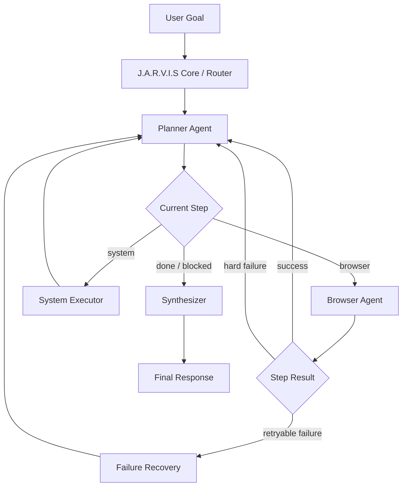
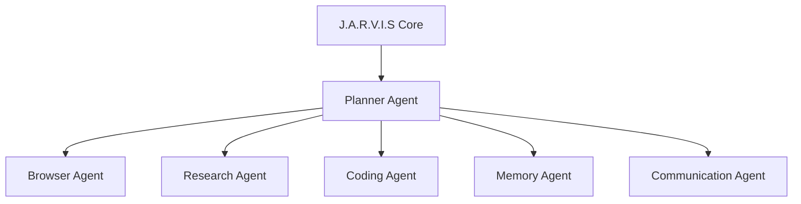

# J.A.R.V.I.S v2 Planner + Browser Architecture

This design is optimized for a browser-first assistant. It is not a generic
multi-agent framework: the Planner owns strategy, the Browser Agent owns page
execution, and the recovery node keeps cheap browser fixes out of the Planner
loop.



## Ownership Boundaries

- J.A.R.V.I.S Core: session routing, memory pre/post hooks, user-facing response
  delivery, and feature-flag selection between legacy and v2 graphs.
- Planner Agent: goal decomposition, success criteria, next objective selection,
  failure analysis, and re-planning. It never sees or chooses selectors.
- Browser Agent: observe page, choose one grounded action at a time, execute
  browser actions, verify local progress, and return structured outcomes.
- Failure Recovery: classify failures, dismiss common blockers, refresh stale
  browser state, reload pages, and escalate authentication or exhausted retries.
- System Executor: thin bridge to existing non-browser tools such as WhatsApp,
  files, weather, and memory.

## State Strategy

The graph state is defined in `state.py` and intentionally separates:

- `user_goal`
- `task_plan`
- `current_step_index`
- `current_browser_state`
- `browser_observations`
- `action_history`
- `failure_history`
- `planner_reasoning`
- `browser_execution_results`
- `task_progress`
- `completion_status`

Planner state is durable and compact. Browser observations are rolling context.
Action and failure histories are bounded so the graph remains low latency.

## Planner Contract

Input: user goal, current plan, recent browser results, recent failures, and
progress notes.

Output:

```json
{
  "reasoning": "why this plan or replan is appropriate",
  "status": "executing",
  "next_objective": "open the relevant site",
  "steps": [
    {
      "id": "step_1",
      "description": "Open the most relevant site",
      "success_criteria": "The browser is loaded at the target site",
      "assigned_agent": "browser",
      "objective_type": "navigate",
      "params": {"url": "https://www.makemytrip.com"},
      "requires_confirmation": false
    }
  ]
}
```

The active system prompt lives in `planner.py` as `PLANNER_SYSTEM_PROMPT`.

## Browser Agent Contract

Input: one `TaskStep`, latest observation, recent actions, recent failures, and
the original user goal.

Output:

```json
{
  "reasoning": "the search field is visible and should drive the next state",
  "candidate_actions": [
    {"action_type": "type", "element_id": "7", "expected_delta": "results load"}
  ],
  "selected_action": {
    "action_type": "type",
    "element_id": "7",
    "text": "Delhi to Goa flights 29 June",
    "press_enter": true,
    "expected_delta": "flight results appear"
  },
  "verification_strategy": "observe after typing and look for matching results"
}
```

The active system prompt lives in `browser_agent.py` as
`BROWSER_AGENT_SYSTEM_PROMPT`.

## Failure Recovery

Failure categories:

- `element_not_found`
- `click_failed`
- `typing_failed`
- `modal_blocked`
- `authentication_required`
- `validation_failed`
- `stale_state`
- `page_timeout`
- `navigation_failed`
- `tool_unavailable`
- `unknown_execution_failed`

Retry policy:

- Local recovery first for cheap fixes: dismiss modal, refresh registry, reload.
- Retry a step only within `TaskStep.max_attempts`.
- Send authentication and confirmation requirements to `needs_user`.
- Re-plan when the retry budget is exhausted or the route is clearly wrong.

## Additional Browser Improvements

- Add per-site playbooks as planner hints, not giant global prompts.
- Store successful action traces by domain and reuse them as few-shot examples.
- Score candidate actions with a deterministic guard before execution.
- Add post-action assertions for typed values, URL deltas, element count deltas,
  and expected text visibility.
- Track modal and login detectors as first-class observation fields.
- Keep screenshots optional and only enable them when text/AX evidence is weak.
- Add domain-specific wait policies for SPAs, infinite scroll, and autocomplete.
- Use result extraction schemas for shopping, travel, and forms so verification
  checks structured facts instead of only page text.

## Future Evolution



To add a new agent later, keep the same `TaskStep` contract, add a node, and
route by `assigned_agent`. The Planner remains the only strategic orchestrator,
so expansion does not require rewriting browser execution.
